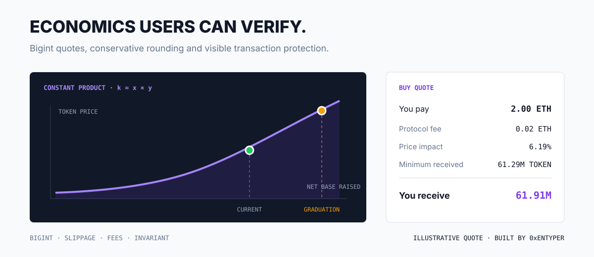
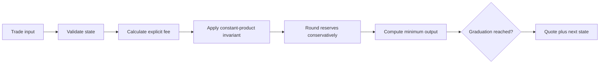
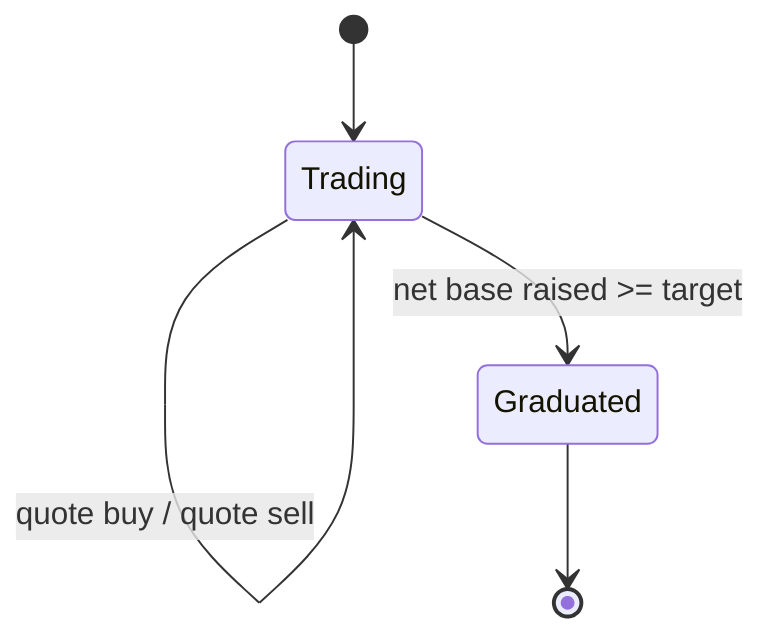
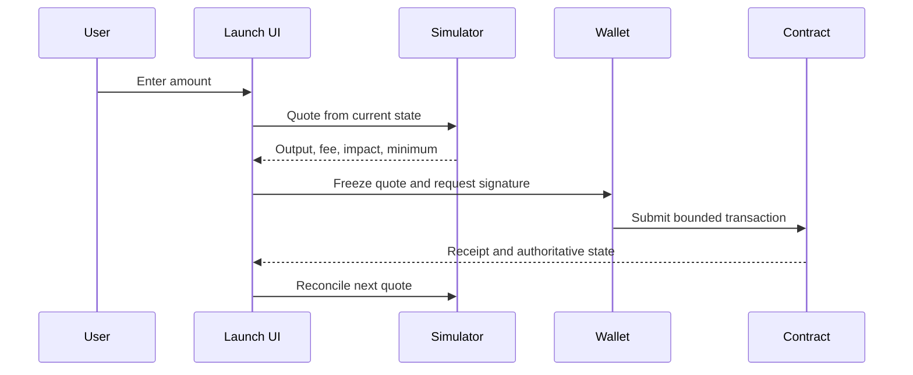

<div align="center">

# Bonding Curve Simulator

### Deterministic bigint quotes for a fair-launch constant-product market.

   

[](https://github.com/0xENTYPER/bonding-curve-simulator/actions/workflows/ci.yml)

</div>

This repository isolates one of the riskiest parts of a token launch product: turning reserve math into quotes that users and contracts can independently reproduce. It models buys, sells, fees, price impact, slippage bounds, net base raised, and graduation.

It is a runnable engineering reference inspired by launchpad work. It is not the production Baggy protocol, deployed contract code, or an audited financial system.



## At a glance

| Concern | Model choice | Product result |
| --- | --- | --- |
| Precision | Integer `bigint` arithmetic | Frontend quotes remain contract-comparable |
| Invariant | Constant product with conservative rounding | Reserve math cannot drift downward through division |
| Fees | Explicit and outside the invariant | Users can see the economic split |
| Slippage | `minimumOut` in every quote | Wallet protection is a concrete amount |
| Lifecycle | Graduation is terminal | The UI cannot quote a closed bonding market |
| Simulation | Quote returns `stateAfter` | Multi-step scenarios need no mutable singleton |

## Why isolate the curve

A launch UI should not invent its own floating-point approximation of protocol economics. A shared deterministic model makes it possible to:

- preview a transaction before wallet confirmation;
- test contract and frontend assumptions against the same vectors;
- show fee and slippage components separately;
- explain why output changes with trade size;
- prevent trading once the market graduates;
- fuzz economic invariants without rendering the application.

## Model

The curve uses virtual reserves and a constant-product invariant:

```text
k = virtualBase * virtualToken
```

For a buy, fees are removed first and the remaining base enters the reserve:

```text
fee = baseIn * feeBps / 10_000
netBase = baseIn - fee
nextToken = ceil(k / (virtualBase + netBase))
tokenOut = virtualToken - nextToken
```

For a sell, token inventory enters the curve and the fee is removed from gross base output. Division rounds reserve values upward so integer precision cannot reduce the invariant.



## Quote contract

```ts
interface TradeQuote {
  side: "buy" | "sell";
  amountIn: bigint;
  amountOut: bigint;
  fee: bigint;
  minimumOut: bigint;
  priceImpactBps: bigint;
  stateAfter: CurveState;
}
```

Every output is an integer in the asset's smallest unit. Formatting belongs to the interface layer, where token decimals are known.

### State transition



Quotes are pure projections. The caller decides whether to commit `stateAfter`; this keeps previews, tests, simulations, and contract reconciliation on the same path.

## Design decisions

| Decision | Reason |
| --- | --- |
| `bigint` throughout | JavaScript floating point is unsafe for contract-scale integers |
| Upward reserve division | Prevent rounding from decreasing `k` |
| Fee outside the invariant | Make protocol economics visible and auditable |
| Net base for graduation | Fees do not falsely advance liquidity funding |
| Quote returns next state | Enables deterministic simulations and test vectors |
| Explicit `minimumOut` | The UI can communicate the actual wallet protection |
| Block after graduation | The bonding market has a clear terminal state |

## Example

```ts
const buy = quoteBuy(config, state, 2n * 10n ** 18n, 100n);

console.log({
  tokensOut: buy.amountOut,
  fee: buy.fee,
  minimumOut: buy.minimumOut,
  impactBps: buy.priceImpactBps,
  graduated: buy.stateAfter.graduated
});
```

For the included reference configuration, a `2 ETH` buy produces a quote shaped like this:

| Line item | Illustrative result |
| --- | ---: |
| User pays | `2.000000 ETH` |
| Protocol fee | `0.020000 ETH` |
| Net reserve input | `1.980000 ETH` |
| Tokens out | `61,913,696.06` |
| Minimum at 1% slippage | `61,294,559.09` |
| Price impact | `6.19%` |

Values are generated from the demo configuration, not a live market or promise of execution. The same raw bigint fields can feed contract fixtures and a human-readable confirmation panel.

### Transaction UI lifecycle



Run the included two-step simulation:

```bash
npm install
npm run check
npm test
npm run demo
```

## Verification

The suite checks:

- invariant preservation after buys and sells;
- monotonic buy output;
- exact fee accrual;
- user-selected slippage protection;
- no profitable immediate round trip;
- graduation threshold behavior;
- post-graduation trade rejection;
- invalid fee and slippage rejection.

These are reference tests, not a substitute for contract fuzzing, symbolic analysis, adversarial MEV testing, or an external audit.

### Economic invariants

| Invariant | Why it is tested |
| --- | --- |
| `kAfter >= kBefore` | Integer rounding must not leak reserve value |
| Larger valid buys return more tokens | Quote output must remain monotonic |
| Round trip cannot create profit | Fees and reserve transitions must resist trivial extraction |
| Net base, not gross input, advances graduation | Protocol fees cannot fake liquidity progress |
| Post-graduation quote rejects | Product and contract lifecycle stay aligned |

## Product and UI rationale

The economics should be legible before signing:

- lead with **You receive** and **You pay**, not reserve jargon;
- put fee, price impact, and minimum received directly below the quote;
- warn on high impact before the primary action becomes available;
- show graduation progress as net liquidity raised, with its exact denominator;
- freeze the quote while the wallet confirmation is open and refresh on expiry;
- distinguish a quote change from a transaction failure;
- never format tiny outputs as zero.

The simulator returns the primitives needed for that UI without coupling economic logic to components.

## Contract integration boundary

Production integration should compare this model against contract view methods and emitted events. The contract remains authoritative. Recommended additions include:

1. generated fixtures from deployed bytecode tests;
2. differential fuzzing between Solidity and TypeScript;
3. reserve and fee reconciliation from events;
4. deadline and maximum-input handling;
5. migration-liquidity accounting at graduation;
6. chain-specific gas and native-token wrapping behavior.

## Repository map

| Path | Responsibility |
| --- | --- |
| [`src/math.ts`](src/math.ts) | Integer division and formatting-safe primitives |
| [`src/curve.ts`](src/curve.ts) | Buy/sell quotes, fees, impact, graduation |
| [`src/model.ts`](src/model.ts) | Configuration, state, and quote contracts |
| [`examples/run.ts`](examples/run.ts) | Deterministic two-step simulation |
| [`test/curve.test.ts`](test/curve.test.ts) | Economic and lifecycle invariants |

## What this case study demonstrates

- translating protocol economics into deterministic frontend-safe code;
- reasoning about integer precision, rounding direction, and invariants;
- exposing fee and risk primitives for understandable transaction UX;
- designing the simulation as a pure state transition rather than hidden mutation;
- separating a public verification model from private deployment parameters.

## Scope

The constants in the demo are illustrative. They do not describe a live market or promise an economic outcome. The repository contains no private deployment addresses, keys, production fee recipients, or launch configuration.

## Author

Built by [0xENTYPER](https://github.com/0xENTYPER).
