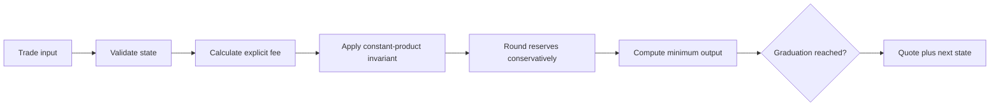

<div align="center">

# Bonding Curve Simulator

### Deterministic bigint quotes for a fair-launch constant-product market.

   

</div>

This repository isolates one of the riskiest parts of a token launch product: turning reserve math into quotes that users and contracts can independently reproduce. It models buys, sells, fees, price impact, slippage bounds, net base raised, and graduation.

It is a runnable engineering reference inspired by launchpad work. It is not the production Baggy protocol, deployed contract code, or an audited financial system.

## Why isolate the curve

A launch UI should not invent its own floating-point approximation of protocol economics. A shared deterministic model makes it possible to:

- preview a transaction before wallet confirmation;
- test contract and frontend assumptions against the same vectors;
- show fee and slippage components separately;
- explain why output changes with trade size;
- prevent trading once the market graduates;
- fuzz economic invariants without rendering the application.

## Model

The curve uses virtual reserves and a constant-product invariant:

```text
k = virtualBase * virtualToken
```

For a buy, fees are removed first and the remaining base enters the reserve:

```text
fee = baseIn * feeBps / 10_000
netBase = baseIn - fee
nextToken = ceil(k / (virtualBase + netBase))
tokenOut = virtualToken - nextToken
```

For a sell, token inventory enters the curve and the fee is removed from gross base output. Division rounds reserve values upward so integer precision cannot reduce the invariant.



## Quote contract

```ts
interface TradeQuote {
  side: "buy" | "sell";
  amountIn: bigint;
  amountOut: bigint;
  fee: bigint;
  minimumOut: bigint;
  priceImpactBps: bigint;
  stateAfter: CurveState;
}
```

Every output is an integer in the asset's smallest unit. Formatting belongs to the interface layer, where token decimals are known.

## Design decisions

| Decision | Reason |
| --- | --- |
| `bigint` throughout | JavaScript floating point is unsafe for contract-scale integers |
| Upward reserve division | Prevent rounding from decreasing `k` |
| Fee outside the invariant | Make protocol economics visible and auditable |
| Net base for graduation | Fees do not falsely advance liquidity funding |
| Quote returns next state | Enables deterministic simulations and test vectors |
| Explicit `minimumOut` | The UI can communicate the actual wallet protection |
| Block after graduation | The bonding market has a clear terminal state |

## Example

```ts
const buy = quoteBuy(config, state, 2n * 10n ** 18n, 100n);

console.log({
  tokensOut: buy.amountOut,
  fee: buy.fee,
  minimumOut: buy.minimumOut,
  impactBps: buy.priceImpactBps,
  graduated: buy.stateAfter.graduated
});
```

Run the included two-step simulation:

```bash
npm install
npm run check
npm test
npm run demo
```

## Verification

The suite checks:

- invariant preservation after buys and sells;
- monotonic buy output;
- exact fee accrual;
- user-selected slippage protection;
- no profitable immediate round trip;
- graduation threshold behavior;
- post-graduation trade rejection;
- invalid fee and slippage rejection.

These are reference tests, not a substitute for contract fuzzing, symbolic analysis, adversarial MEV testing, or an external audit.

## Product and UI rationale

The economics should be legible before signing:

- lead with **You receive** and **You pay**, not reserve jargon;
- put fee, price impact, and minimum received directly below the quote;
- warn on high impact before the primary action becomes available;
- show graduation progress as net liquidity raised, with its exact denominator;
- freeze the quote while the wallet confirmation is open and refresh on expiry;
- distinguish a quote change from a transaction failure;
- never format tiny outputs as zero.

The simulator returns the primitives needed for that UI without coupling economic logic to components.

## Contract integration boundary

Production integration should compare this model against contract view methods and emitted events. The contract remains authoritative. Recommended additions include:

1. generated fixtures from deployed bytecode tests;
2. differential fuzzing between Solidity and TypeScript;
3. reserve and fee reconciliation from events;
4. deadline and maximum-input handling;
5. migration-liquidity accounting at graduation;
6. chain-specific gas and native-token wrapping behavior.

## Scope

The constants in the demo are illustrative. They do not describe a live market or promise an economic outcome. The repository contains no private deployment addresses, keys, production fee recipients, or launch configuration.

## Author

Built by [0xENTYPER](https://github.com/0xENTYPER).
